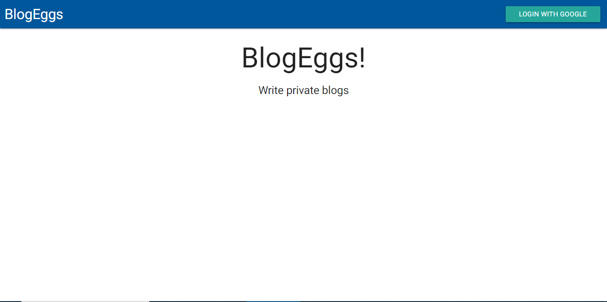
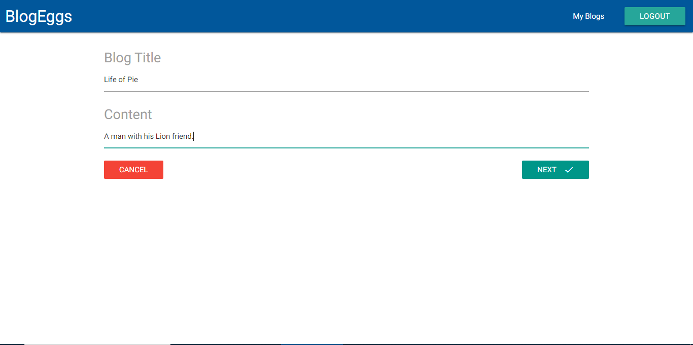
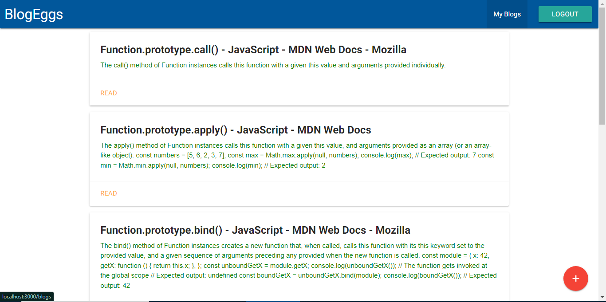

### Setup

- create dev.js file inside your config folder and add following properties.

  `module.exports = {  `

  `googleClientID:
"your google client id", `

  `googleClientSecret: "your client secret",`

  `mongoURI:
"your Mongo_Url",`
  `cookieKey: "Your key",`

  `}; `

- Run `npm install` in the root of the project to install server dependencies
- Change into the client directory and run `npm install --legacy-peer-deps`
- Change back into the root of the project and run `npm run dev` to start the server
- Access the application at `localhost:3000` in your browser

# ScreenShots

- 
- 
- 
